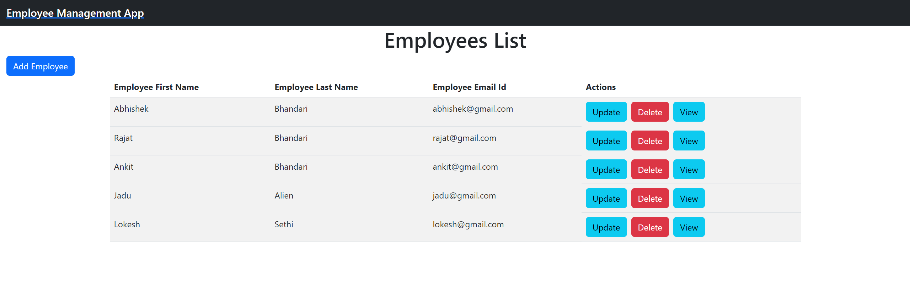
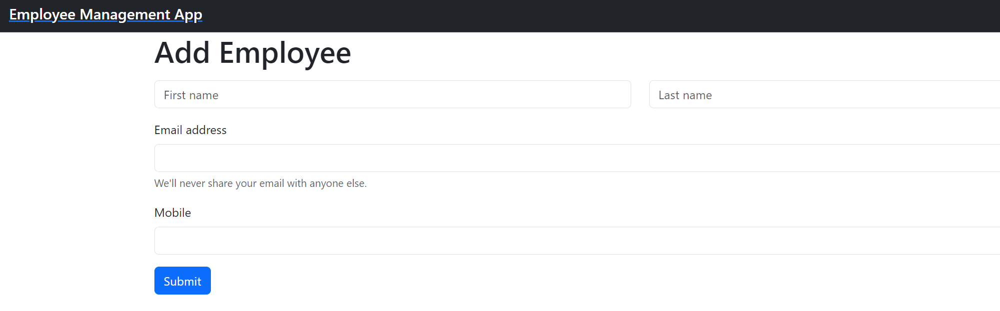
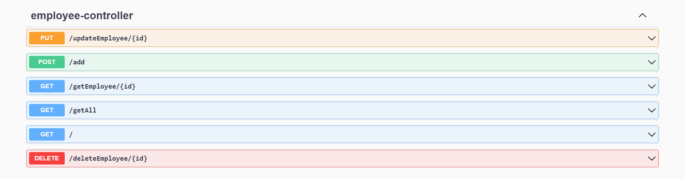

# Getting Started

This project was generated with [Angular CLI](https://github.com/angular/angular-cli) version 16.1.0.

The Backend Application is using java version 17.

# Prerequisites

To run the application successfully you need to run the Spring Boot Server first in your local machine.


## Installation of Development server

First, you should run the sql file given with the project so that required database and required table is created.

Second, head over to application.properties file which is present in resources folder and change the port number of mysql url if you have something else. 

Third, now change the username and password in application.properties.

```
#database connection
spring.datasource.url=jdbc:mysql://localhost:3306/employee
spring.datasource.username=root
spring.datasource.password=root

```

Forth, now run the springboot app you can access the spring boot directly using

http://localhost:5000/swagger-ui/index.html

Fifth, now open the frontend folder in vscode,then open terminal and run this command to install the dependencies needed to run the app.

`npm install`

Sixth, Run this command to build and serve the Angular app.

`ng serve`

Seventh, Navigate to `http://localhost:4200/`. The application will automatically reload if you change any of the source files.





# API Endpoints

- Create Employee :- http://localhost:5000/add - Post Request
- List Employee :- http://localhost:5000/getAll - Get Request
- Update Employee :- http://localhost:5000/updateEmployee/{id} - Put Request
- Delete Employee :- http://localhost:5000/deleteEmployee/{id} - Delete Request
- View Employee :- http://localhost:5000/getEmployee/{id} - Get Request



# Authors

 **Abhishek Bhandari** - *Initial work* - **[abhi-shek-bhandari](https://github.com/abhi-shek-bhandari)**